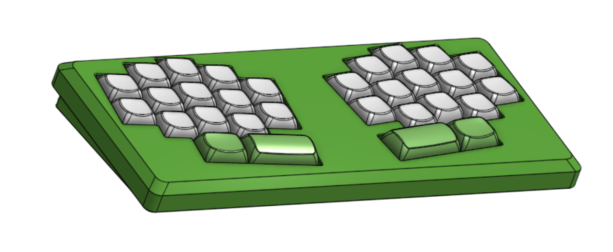

# le colibri

Le Colibri is a 30-key unibody split keyboard inspired by Le Chiffre and the Hummingbird.

## Disclaimers

1. This keyboard came to me in a dream so I had to bring it into the waking world. It is not necessarily good. But here it is.

2. ~~I am posting this on GitHub prior to actually receiving PCBs and printing the case and making sure everything works. Your mileage may vary. Good luck.~~

   I have now gotten my PCBs and printed a case, and successfully assembled a keyboard. No firmware yet so still can't really be sure it works. More updates to come.

## FAQ

**Why not just [chiffchaff](https://github.com/kilipan/chiffchaff)?**  
Like I said, this keyboard was designed in a dream. The dreamt keyboard was not chiffchaff but something much worse, which you see here.

**Can I use a regular Chiffre case or PCB?**  
No, it is basically completely incompatible. See *Case* section below.

## BOM

- 30x SOD-123 1N4148 diodes
- 30x Kailh MX hotswap sockets
- One Seeduino XIAO (designed for RP2040, but will work with others -- maybe you can even make it wireless if you bodge a battery onto the NRF one!)

## Case

The switchplates are obviously incompatible with a normal Chiffre. The in-plane XIAO makes this keyboard incompatible with the bottom case. And the reduced number of keys would make it dumb to use the top, unless you like huge gaps. Custom case files can be found in [case/](case/).

Screw the switchplate into the case before putting any switches in it - the PCB blocks a couple of the holes.

The only support needed during printing is on the bottom case, near the outer edges of the screw holes.

## Acknowledgements

- Inspired by the original [tominabox1/Le-Chiffre-Keyboard](https://github.com/tominabox1/Le-Chiffre-Keyboard/) and [PJE66/hummingbird](https://github.com/PJE66/hummingbird)
- MCU footprint derived from [ebastler/marbastlib](https://github.com/ebastler/marbastlib/)
- Layout derived from ergogen source supplied for [sporkus/le_capybara_keyboard](https://github.com/sporkus/le_capybara_keyboard)
- Logo by Sune
- Case modification by Donny
